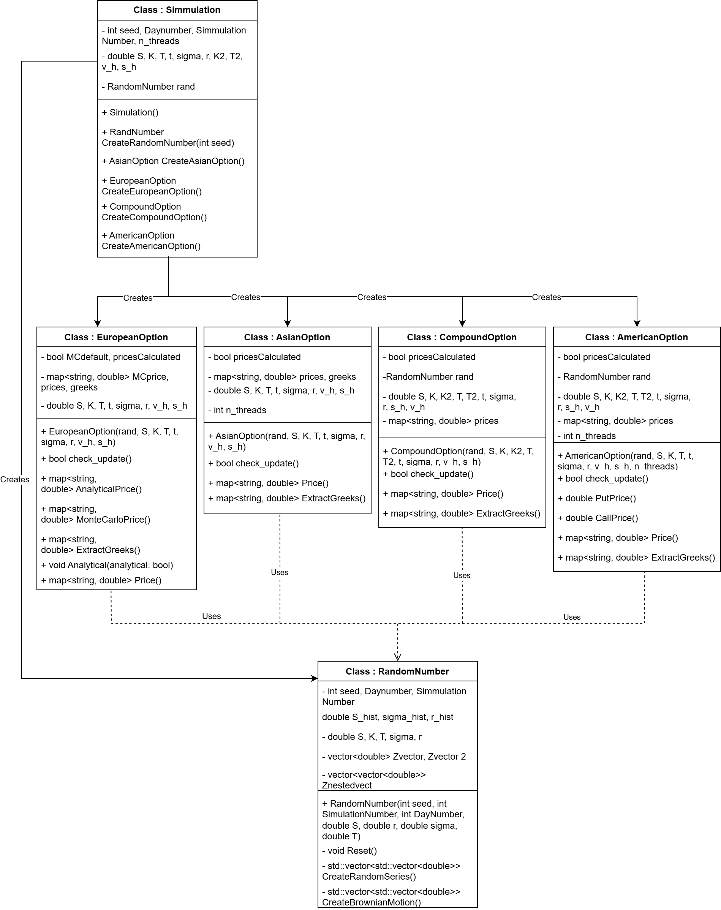

# Monte Carlo Option Pricing Library (C++)

This repository provides a Monte Carlo simulation library in C++ designed for pricing financial options. The library supports different option types, including European, Asian, American, and Compound options, leveraging stochastic processes and numerical methods for valuation.

## Features

- **Monte Carlo Simulation**: A robust framework for simulating stochastic processes.
- **Support for Multiple Option Types**:
  - European Options
  - Asian Options
  - American Options
  - Compound Options
- **Random Number Generation**:
  - Custom random number generator (`RandomNumber`) for generating Gaussian random variables and Brownian motion.
- **Greeks Calculation**: Extract option sensitivities such as delta, gamma, vega, and vomma.
- **Multithreading Support**: Utilize multiple threads for performance optimization.

## Class Structure



### Key Components

1. **Simulation Class**:
   - Manages the creation and orchestration of simulations for various options.
   - Creates and manages `RandomNumber` instances and option objects.
   - Methods to initialize and execute simulations.

2. **Option Classes**:
   - `EuropeanOption`, `AsianOption`, `AmericanOption`, `CompoundOption`
   - Each class implements pricing and Greeks extraction for the respective option type.
   - Uses `RandomNumber` for simulating stochastic processes.

3. **RandomNumber Class**:
   - Handles random number generation, Gaussian sampling, and Brownian motion.
   - Provides utilities for simulations, such as generating correlated random variables.

## Installation

### Prerequisites
- C++17 or later
- A C++ compiler (e.g., GCC, Clang, MSVC)
- CMake (optional, for build automation)

### Build Instructions
1. Clone the repository:
   ```bash
   git clone https://github.com/your-username/Monte-Carlo-Library-cpp.git
   cd Monte-Carlo-Library-cpp
